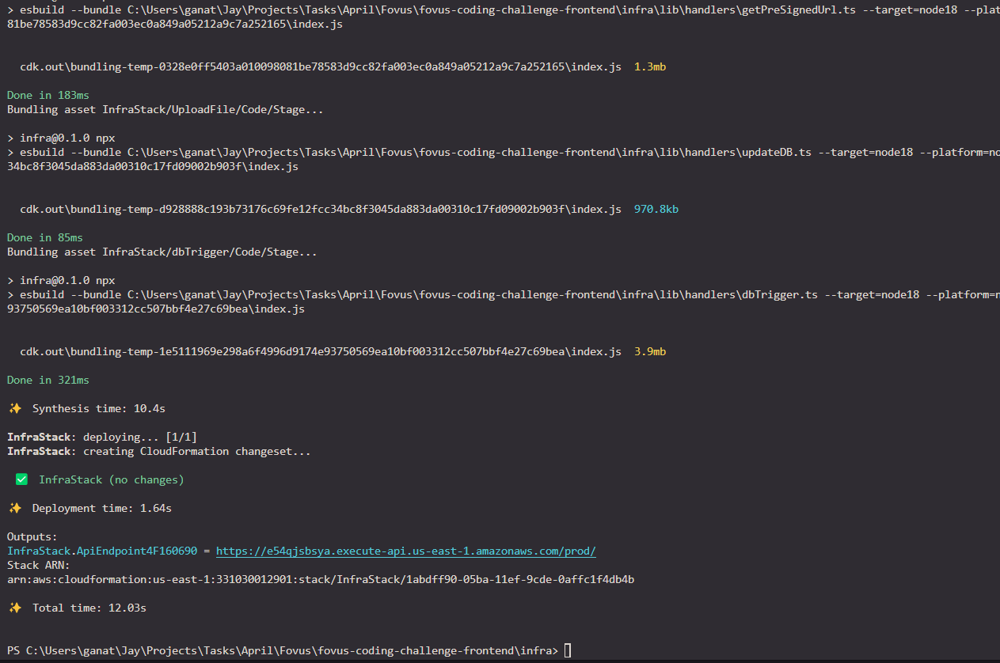
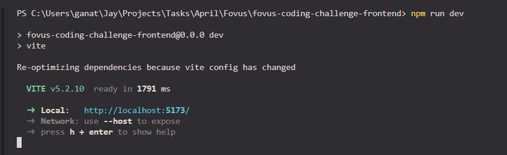

# fovus-coding-challenge-~~frontend~~-repo

A React app with AWS microservices as a backend.

### Stack:

**Frontend:** React, TailwindCSS, shadcn/ui, axios, react-hook-forms

**AWS:** API Gateway, IAM, Lambda, EC2, DynamoDB, S3

## Steps to deploy locally

You need the AWS CLI and the AWS CDK installed. Here is how you can do that: [AWS CLI Installation](https://docs.aws.amazon.com/cli/latest/userguide/getting-started-install.html)

```console
$ npm install -g aws-cdk
$ git clone https://github.com/GanatraJay2000/fovus-coding-challenge-frontend.git

cd into directory (fovus-coding-challenge-frontend)

$ npm install

$ cd infra
$ cdk bootstrap aws://<ACCOUNT-NUMBER/ID>/us-east-1      # Run the aws bootstrap command with your account_number
$ npm run cdk deploy      # Press 'y' when prompted.
```

> [!NOTE]
> The last command `npm run cdk deploy` outputs an `InfraStack.ApiEndpoint`. (Highlighted in blue in below screenshot) COPY THAT.



Go to root folder of your app. Create a `.env`file, and paste the url there like:

```console
VITE_BASE_URL="<your_url_output_from_cdk_deploy_command>"
```


THEN FINALLY: From the root of your app, open terminal and run this command:

```console
$ npm run dev
```



The app starts working.


> [!IMPORTANT]
> [DEMO VIDEO LINK](https://drive.google.com/file/d/11JeWA-Z6ZgWCj6xWxEHrX-cHu2vtKVmU/view?usp=drive_link)


## References:

https://react-hook-form.com/get-started

https://www.youtube.com/watch?v=XlAs-Lid-TA

https://aws.amazon.com/blogs/architecture/deploying-sample-ui-forms-using-react-formik-and-aws-cdk/

https://aws.amazon.com/blogs/mobile/deploying-a-static-website-with-aws-amplify-and-cdk/

https://docs.aws.amazon.com/amplify/latest/userguide/setting-up-GitHub-access.html

https://stackoverflow.com/questions/59135352/write-s3-objects-with-cdk

https://dynobase.dev/dynamodb-triggers/

https://dev.to/aws-builders/how-to-trigger-an-aws-lambda-from-a-dynamodb-stream-event-d8

https://docs.aws.amazon.com/ec2/latest/devguide/example_ec2_RunInstances_section.html

https://stackoverflow.com/questions/10541363/self-terminating-aws-ec2-instance

https://www.futurelearn.com/info/courses/linux-for-bioinformatics/0/steps/202962

https://docs.aws.amazon.com/AWSJavaScriptSDK/v3/latest/client/ec2/

https://docs.aws.amazon.com/AWSJavaScriptSDK/v3/latest/client/iam/

https://stackoverflow.com/a/5257398

https://www.digitalocean.com/community/tutorials/how-to-transform-json-data-with-jq

https://linuxize.com/post/bash-if-else-statement/
